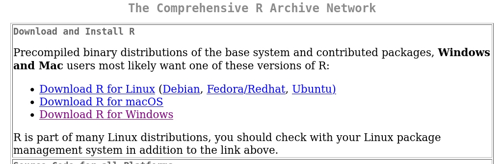
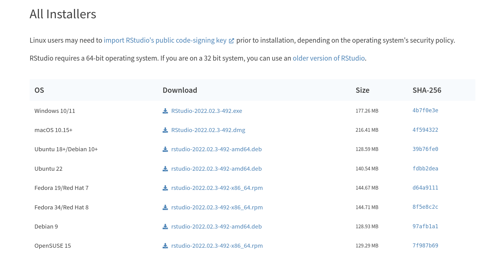

```{r setup, include=FALSE}
knitr::opts_chunk$set(echo = TRUE)
```

## Naming the beasts

R (yes, the letter "R") is a **programming language** that derives from another, older programming language with a bias for statistics, that was called S (yes, the letter "S"). R's primary website is called [The R Project for Statistical Computing](https://www.r-project.org/) and the software with all its dependencies is primarily stored in a network of servers called [the Comprehensive R Archive Network (CRAN)](https://cran.r-project.org/), with [mirroring servers](https://cran.r-project.org/mirrors.html) all around the world.

It is good to recognize "founding fathers", so let's say here that the original developers of R are Robert Gentleman and Ross Ihaka, from the stats department of the university of Auckland, New Zealand. John Chambers was the principal developer of S, and jumped onboard the R core developer team soon into R's history. You will see his name at the bottom of many help pages for R commands.

R is now a whole ecosystem whose core is a [GNU project](https://www.gnu.org/software/software.en.html). At the time of writing this (beginning of July 2022), the latest release of R is codenamed "Funny-Looking Kid" and bears version number 4.2.1.

[RStudio](https://www.rstudio.com/products/rstudio/) is an Integrated Development Environment (IDE) that enables its users to write and execute R code in a friendly way through a graphical user interface (GUI). RStudio is developed by a Boston-based company bearing the same name, which develops open-source software but also commercial data analysis solutions. RStudio is a strong driver of the R ecosystem, with a guy named Hadley Wickham (you will hear a lot about him when it comes to the *tidyverse* set of libraries, a kind of "R 2.0" on its own) as its chief scientist. You can learn more about RStudio and its hybrid "public-good" and "for-profit" model on [their "about" page](https://www.rstudio.com/about/). RStudio **is not** R, but that's such a nice programming environment to use that almost all current R users have adopted it as their favorite (disclaimer: personal opinion here!).

In order to use R conveniently on one's own computer, one has to install R and RStudio. Those two pieces of software are fully cross-platform, which means you will be able to install them irrespective of the operating system you are using: R & RStudio are for Microsoft Windows, Apple macOS or GNU/Linux (any distro).


## Installing R on your own computer

The first step you have to perform is therefore to install the R environment on your computer. This will enable you to execute R programs. By so doing, you will actually be installing an *R interpreter*. Proceed through the [CRAN master website](https://cran.r-project.org/) or any of the CRAN mirror sites (e.g. <https://cran.mirror.ac.za/> for the CRAN mirror in South Africa) and download the R software package corresponding to your computer's operating system. You will usually want to download and install a precompiled binary distribution of R, so click the appropriate link in the first frame on the page, as shown below.



Just install the base R package, there is no need at this stage for you to install any set of contributed packages ("add-ons", in a way). Please follow the links and read the instructions. On Windows, you will probably download one executable installer file like [this one for R version 4.2.1](https://cran.r-project.org/bin/windows/base/R-4.2.1-win.exe), while on GNU/Linux you will be able to install R via your distro's favorite software package manager (e.g. install `r-base` and `r-base-dev` on *apt*-based distributions, `R-core` and `R-core-devel` on *yum*-based distributions, etc).


## Installing RStudio on your own computer

Next, you have to proceed with installing RStudio. As we are installing on our own computer, we pick the free RStudio Desktop available on [RStudio's download page](https://www.rstudio.com/products/rstudio/download/#download). Again, here: follow the instructions pertaining to your own operating system. You will likely find a precompiled binary version for your own OS, to install and run straight out of the box (see below).




## Getting familiar with RStudio's interface

If you're running some GNU/Linux system, you can interact with the R interpreter right by firing `R` on the commandline, and run already written R scripts through the `Rscript` command. Fine, but that is not the usual route people will pick: therefore, in the remaining, we will assume we are running RStudio Desktop's graphical user interface, irrespective of one's operating system.

Once you have installed R and RStudio (see above), you are ready to launch the RStudio environment. Once open, the RStudio window will look like that, with the four standard panes displayed:

, CC BY SA Rstudio®)](Figs/rstudio_master_view.png)

The four standard panes (or "sub-windows") of RStudio are traditionally organized as follows. You may want, while working with RStudio, to hide or minimize some of them (see the icons on the top right of each pane, or the "Workspace Panes" toolbar item that looks like a window with a 2x2 grid at the top of the above screenshot). Anticlockwise from top left, we have:

1. the **source editor** pane. That is where you type code that you will save in a file, to edit, enrich and reuse later on. To execute the line your cursor is currently on, hit `Ctrl`+`Enter` while in the source editor pane. Only typing `Enter` while in this pane just adds a blank line to your current file and moves the cursor there.
2. the **console** pane. This is the space for direct interactions with the R interpreter: you type something in there, and R "answers" after interpreting what you typed into R language. That is also where you will see those R error messages you will get without fail ;). Whenever you execute one or several lines of your current file in the source editor, the results of that execution appear in the console pane. The things you are typing in the console pane are *not* saved in any file, besides the internal R history of commands.
3. the bottom right pane is mostly used for **plots and help pages** (I will continuously use the vocable "manpages" for "help pages"). Depending on your interactions with R, RStudio will automatically switch from one tab to the next in this pane. For instance, if you ask for a manpage, it will be loaded there and the switch from displaying the `Help` tab instead of the `Plots` tab (provided that is what was displayed) will take place automatically. The `Files` tab can be used to display the files in your filesystem, with starting point being your current *working directory* (more on the story about this "working directory" in the "Intro to R" tutorial )
4. the top right pane is most commonly used to display the current variables in your **environment** (`Environment` tab). When we say "current variables", we mean **R objects** that are residing in the computer's volatile memory while you are in the middle of an R session using RStudio. Such variables can be numeric vectors, data frames, etc. More on those in the "Intro to R" tutorial. Within this fourth pane, the `History` tab enables you to view (and export, if you so wish) the history of the R commands you have entered so far.

The decorated screenshot above is taken from RStudio's excellent [RStudio IDE cheatsheet](https://raw.githubusercontent.com/rstudio/cheatsheets/main/rstudio-ide.pdf), forming part of a series of cheatsheets (the rule thereof being to fit as much info in a palatable, nice-looking way, on no more than two landscape-format pdf pages) to be found [here](https://www.rstudio.com/resources/cheatsheets/). I strongly encourage you to download, print and pin as many of those cheatsheets to adorn the walls of your physical workspace. :)

